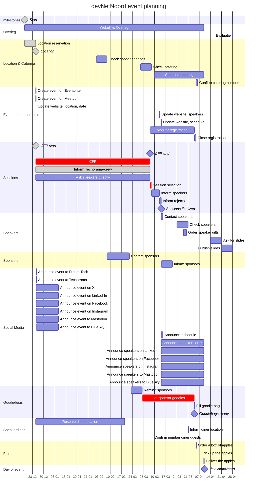

# Event planning devCampNoord

Load the content between the three "ticks" in the [Mermaid live editor](https://mermaid.live/) to visualize the Gantt chart.

```mermaid
gantt
    dateFormat   DD-MM-YYYY
    title        devNetNoord event planning
    %%excludes     weekends
    tickInterval 1week
    weekday      monday
    axisFormat   %d-%m
    %% (`excludes` accepts specific dates in YYYY-MM-DD format, days of the week ("sunday") or "weekends", but not the word "weekdays".)

    section milestones
    %% Start, planning event date, event location, diner location.
    Start                          :done, milestone, start, 18-12-2024, 0d

    section Overleg
    %% Wekelijk overleg, vanaf start-datum tot het event.
    Wekelijks Overleg              :wekelijks-overleg, after start, until event-day
    %% Eénmalig evaluatie overleg.
    Evaluatie                      :evaluatie-overleg, after publish-slides, 3h

    section Location & Catering
    %% Location is reserved
    Location reservation           :done, location-reservation, after start, 7d
    Location                       :done, milestone, location, after location-reservation, 0d
    Check sponsor spaces           :check-sponsor-spaces, 01-02-2025, 7d
    Check catering                 :check-location-catering, 01-03-2025, 7d
    Sponsor mapping                :sponsor-mapping, 10-03-2025, until event-day
    Confirm catering number        :catering-number, after close-registration, 1d

    section Event announcements
    Create event on Eventbrite     :done, create-eventbrite, after location, 4h
    Create event on Meetup         :done, create-meetup, after location, 4h
    Update website, location, date :done, website-update-event, after create-eventbrite, 4h
    Update website, speakers       :website-update-speakers, after inform-speakers, 4h
    Update website, schedule       :website-update-schedule, after sessions-finalized, 4h
    Monitor registration           :monitor-eventbrite, after cfp-end, until goodie-bags-ready
    Close registration             :close-registration, after monitor-eventbrite, 1d

    section Sessions
    %% Initialize CFP on Sessionize, 14-16 weeks before the event.
    CFP-start                      :done, milestone, cfp-start, after location, 0d
    %% Duration 10-12 weeks after cfp-start
    %% Date is now static set to 07-03-2025 but should be 10-12 weeks after the cfp-start, end date 8 week before the event
    CFP-end                        :milestone, cfp-end, 07-03-2025, 0d
    %% Duration of the CFP, 10-12 weeks.
    CFP                            :crit, cfp, after cfp-start, until cfp-end
    %% Inform possible speakers from the Techorama crew.
    Inform Techorama-crew          :done, inform-techorama-crew, after cfp-start, until session-selection
    %% Inform specific sprekers (keynote or from other interesting fields outside the "normal" circle).
    Ask speakers directly          :ask-speakers, after cfp-start, until session-selection
    %% Session selection.
    Session selection              :crit, session-selection, after cfp, 1d
    %% Inform spreakers on their chosen session(s), 6 weeks before the event. Duration 1 week to get confirmation.
    Inform speakers                :inform-speakers, after session-selection, 5d
    %% Inform the speakers on the rejected sessions.
    Inform rejects                 :inform-rejects, after inform-speakers, 1d
    %% Milestone
    Sessions finalized             :milestone, sessions-finalized, after inform-rejects, 0d

    section Speakers
    %% After all rejects are informed, contact the speakers
    Contact speakers               :contact-speakers, after sessions-finalized, 1d
    %% 2 weeks before event (start on monday), ask in everything is according, ask to join speaker diner and preferences/wishes
    Check speakers                 :check-speakers, 24-03-2025, 7d
    %% Gifts for the speakers, two weeks before the event.
    %% If possible deliverd to the location on the day of the event
    Order speaker gifts            :order-speaker-gift, 28-03-2025, 2d
    %% In the week after the event, ask speakers for slides (start on monday)
    Ask for slides                 :ask-slides, 14-04-2025, 7d
    %% Publsih slides on SpeakerDeck
    Publish slides                 :publish-slides, after ask-slides, 7d

    section Sponsors
    %% Inform the sponsors on the chosen sessions, inform on the event booth and ask for goodies, half-way the CFP
    Contact sponsors               :contact-sponsors, after check-sponsor-spaces, 14d
    %% Inform sponsors on progress, and goodie reminder
    Inform sponsors                :inform-sponsors, after sessions-finalized, 7d

    section Social Media
    Announce event to Future Tech  :after website-update-event, 4h
    Announce event to Techorama    :after website-update-event, 4h
    Announce event on X            :after website-update-event, 14d
    Announce event on Linked-In    :after website-update-event, 14d
    Announce event on Facebook     :after website-update-event, 14d
    Announce event on Instagram    :after website-update-event, 14d
    Announce event to Mastodon     :after website-update-event, 14d
    Announce event to BlueSky      :after website-update-event, 14d
    Announce schedule              :after sessions-finalized, 1d
    Announce speakers on X         :after sessions-finalized, 10-04-2025
    Announce speakers on Linked-In :after sessions-finalized, until event-day
    Announce speakers on Facebook  :after sessions-finalized, until event-day
    Announce speakers on Instagram :after sessions-finalized, until event-day
    Announce speakers to Mastodon  :after sessions-finalized, until event-day
    Announce speakers to BlueSky   :after sessions-finalized, until event-day

    section Goodiebags
    %% Remind sponsors of the goodies to send or order
    Remind sponsors                :remind-sponsors, 23-02-2025, 7d
    %% Retrieve the sponsor goodies, needs follow-up / monitoring
    Get sponsor goodies            :crit, get-sponsor-goodies, after remind-sponsors, until goodie-bags-ready
    %% On the Friday 6 days before the event we fill the goodie bags.
    Fill goodie bag                :fill-goodie-bag, after get-sponsor-goodies, 4h
    %% Goodie bags filled
    Goodiebags ready               :milestone, goodie-bags-ready, 04-04-2025, 0d

	section Speakerdiner
    %% Reserve the diner location
    Reserve diner location         :reserve-diner-location, after location, 8w
    %% One weeks before the event, give an estimate of the number of guests and their wishes (allergies, vegetarian, vegan etc.)
    Inform diner location          :inform-diner-location, after check-speakers, 4h
    %% One day or on the day of the event, confirm the expected number of people to join for diner
    Confirm number diner guests    :confirm-diner-guests, 09-04-2025, 4h

    section Fruit
    %% Order apples in the weekend before the event
    Order a box of apples          :order-apples, 05-04-2025, 4h
    %% Pick up the apples before the event, the evening before or one day earlier at the market
    Pick up the apples             :get-apples, 08-04-2025, 4h
    %% DEliver the apples to the event location
    Deliver the apples             :deliver-apples, 10-04-2025, 1h

    section Day of event
    %% d-day ;-)
    devCampNoord                   :milestone, event-day, 10-04-2025, 1d
```